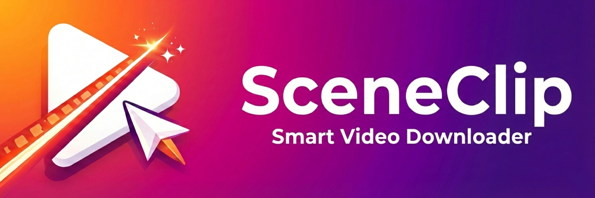
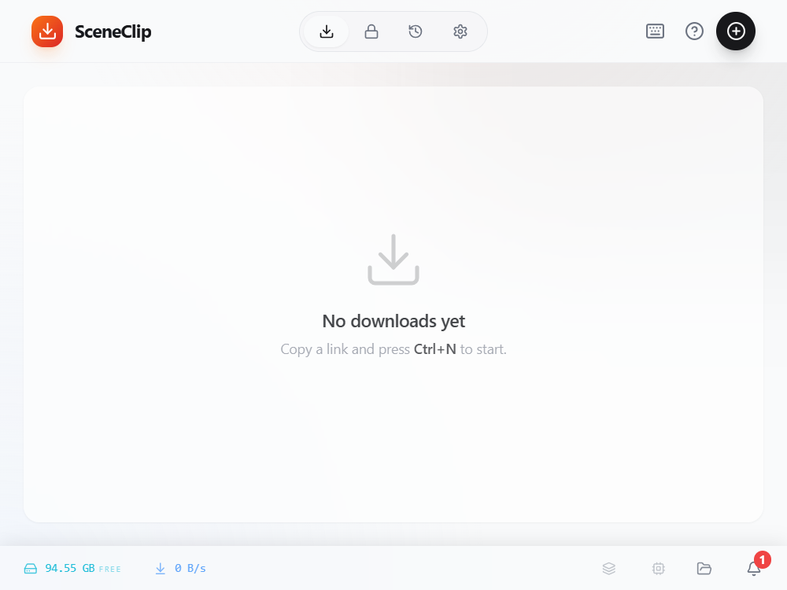
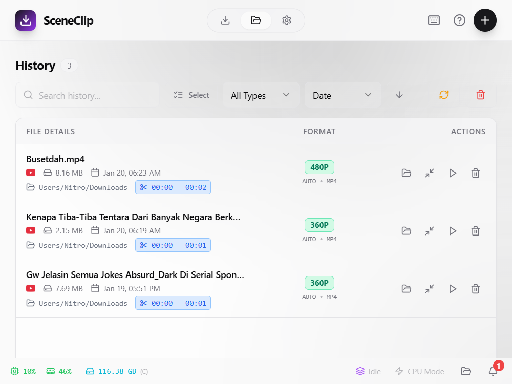
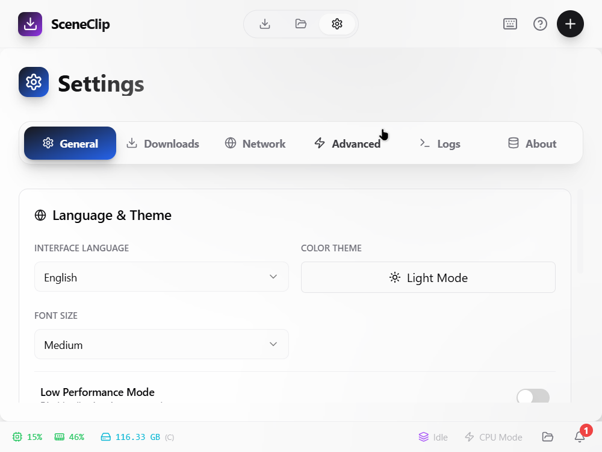
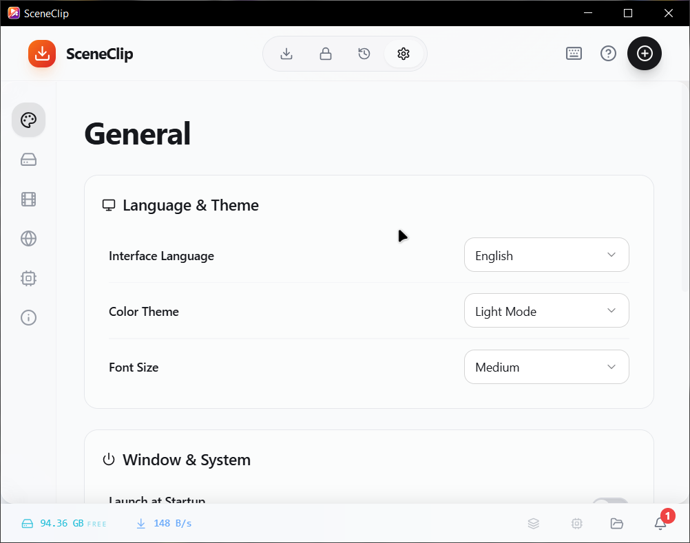

<p align="center">
  
</p>

<h1 align="center">SceneClip</h1>

<p align="center">
  <b>The Ultimate GUI for yt-dlp and ffmpeg</b><br/>
  <sub>Download videos, extract audio, and create precise clips with correct metadata — no command line required.</sub>
</p>

<p align="center">
  
  
  
  
  <br/>
  
  
  
</p>

<p align="center">
  <a href="#features">Features</a> •
  <a href="#quick-start">Quick Start</a> •
  <a href="docs/GUIDE.md">User Manual</a> •
  <a href="docs/TROUBLESHOOTING.md">Troubleshooting</a> •
  <a href="./supportedsites.md">Supported Sites</a> •
  <a href="#contributing">Contributing</a>
</p>

---

## Why SceneClip?

Command-line tools like `yt-dlp` are incredibly powerful, but they come with a steep learning curve — cryptic flags, manual ffmpeg piping, and no visual feedback. **SceneClip bridges that gap.** It wraps the full power of `yt-dlp` and `ffmpeg` in an intuitive desktop interface, so you get professional-grade media downloading without ever touching a terminal.

<p align="center">
  
  <br/>
  <sub>Demo — Paste URL, select quality, download with one click</sub>
</p>

---

### Screenshots

<table>
  <tr>
    <td align="center">
      
      <br/><sub><b>Downloads</b> — Active queue & progress tracking</sub>
    </td>
    <td align="center">
      
      <br/><sub><b>Keyring</b> — Secure credential storage</sub>
    </td>
  </tr>
  <tr>
    <td align="center">
      
      <br/><sub><b>History</b> — Browse past downloads</sub>
    </td>
    <td align="center">
      
      <br/><sub><b>Settings</b> — Customize your experience</sub>
    </td>
  </tr>
</table>

---

## Features

SceneClip provides a complete media downloading solution with these core capabilities:

| Feature | Description |
|:--------|:------------|
| **Smart Detection** | Automatically detects URLs from your clipboard. Just copy a link and SceneClip is ready. |
| **Precision Clipping** | Download specific segments of videos by setting start/end timestamps. No need for the full file. |
| **GIF Maker** | Convert video clips into optimized GIF animations with customizable FPS and scale. |
| **Batch Downloading** | Queue multiple URLs for hands-free, sequential processing. |
| **SponsorBlock** | Automatically skip sponsor segments, intros, and outros (YouTube). |
| **Secure Keyring** | Store credentials using your OS's native encrypted vault for premium content access. |
| **Multi-Language** | Available in English, Indonesian, Malay, and Mandarin Chinese. |

For a complete guide on all features, see the **[User Manual](docs/GUIDE.md)**.

---

## Tech Stack

SceneClip is built using modern, high-performance technologies:

*   **Core**: [Tauri v2](https://tauri.app) (Rust) - For a tiny footprint and maximum security.
*   **Frontend**: React 18 + TypeScript + TailwindCSS - Ensuring a snappy, beautiful UI.
*   **Engine**:
    *   [yt-dlp](https://github.com/yt-dlp/yt-dlp): The rigorous industry standard for media extraction.
    *   [FFmpeg](https://ffmpeg.org): For powerful media processing, merging, and conversion.
    *   [Aria2c](https://aria2.github.io): For multi-connection accelerated downloading.

**[View Full List of Supported Sites](./supportedsites.md)** — Thousands of platforms including YouTube, Twitter, Instagram, TikTok, and more.

---

## Quick Start

### Installation (For Users)

SceneClip bundles **ffmpeg** and **yt-dlp** automatically — no manual installation needed!

| Platform | Installer | Portable |
|:--------:|:---------:|:--------:|
|  | `.exe` setup | `.zip` (extract & run) |
|  | `.dmg` | `.zip` (extract & run) |
|  | `.deb` | `.AppImage` (portable) |

> **[Download the Latest Release](https://github.com/Myunikon/SceneClip/releases)**

**Note**: Windows SmartScreen may warn you because the app is not code-signed yet. Click **More Info** then **Run Anyway** to proceed.

---

## Project Structure

For contributors and developers, here is the detailed breakdown of our repository:

```
SceneClip/
├── .github/workflows/  # CI/CD Workflows (Release, Builds)
├── browser_extension/  # Source code for the browser companion extension
├── docs/               # Documentation (User Guide, FAQ)
├── public/             # Static assets (images, icons)
├── scripts/            # Build & Setup scripts
│
├── src/                # Frontend (React + TypeScript)
│   ├── assets/         # CSS & Platform icons
│   ├── components/     # UI Components
│   │   ├── common/     # Shared components (Shortcuts, Notifications)
│   │   ├── dialogs/    # Modals (Add, Guide, Confirmation)
│   │   ├── downloads/  # Download list & items view
│   │   ├── history/    # History view components
│   │   ├── layout/     # App shell & header
│   │   ├── providers/  # Context (Updater, AppGuard, Clipboard)
│   │   └── settings/   # Settings pages (Network, System, etc.)
│   ├── hooks/          # Custom React Hooks
│   ├── lib/            # Utilities & Locales (i18n)
│   ├── store/          # Zustand State Management
│   └── main.tsx        # Entry point
│
├── src-tauri/          # Backend (Rust)
│   ├── resources/      # Sidecar plugins (Python scripts)
│   ├── src/            # Rust Source code
│   │   ├── commands/   # Modularized Tauri Commands
│   │   └── ytdlp.rs    # Core yt-dlp wrapper logic
│   └── tauri.conf.json # Configuration
│
└── README.md
```

---

## Privacy & Security

We believe in **Local Processing** and **Zero Knowledge**.

### Local Storage
SceneClip does **not** have a cloud backend.
*   **Passwords**: Your Saved Passwords in the Keyring Manager are encrypted using the OS's native secure vault (Windows Credential Manager / macOS Keychain). We cannot access them.
*   **Cookies**: Imported cookies are stored locally in `AppData` and used solely by `yt-dlp` to authenticate with video sites on your behalf.
*   **History**: Your download history resides in a local JSON file on your machine.

### Zero Telemetry
SceneClip does not track your downloads, search history, or personal data. Network requests are made strictly to:
1.  The video sites you are downloading from.
2.  GitHub API (only if you click "Check for Updates").

---

## Developer Guide

Interested in contributing? Follow these steps to set up your environment.

### 1. System Prerequisites

You need **Node.js 18+** and **Rust (Stable)** installed on all platforms. Then, follow your OS specific steps:

<details open>
<summary><b>Windows</b></summary>
<br>

1.  **Install C++ Build Tools**:
    Download "Visual Studio Build Tools" and ensure "Desktop development with C++" is selected.
    
2.  **Install Rust**:
    Download the installer from [rust-lang.org](https://www.rust-lang.org/tools/install).

3.  **WebView2**:
    Windows 10/11 usually has this pre-installed. If not, download the "Evergreen Bootstrapper".
</details>

<details>
<summary><b>Linux</b></summary>
<br>

You need build-essential and WebKitGTK libraries.

**Debian / Ubuntu**:
```bash
sudo apt update
sudo apt install libwebkit2gtk-4.0-dev build-essential curl wget file libssl-dev libgtk-3-dev libayatana-appindicator3-dev librsvg2-dev
```

**Arch Linux**:
```bash
sudo pacman -Syu
sudo pacman -S --needed webkit2gtk base-devel curl wget file openssl appmenu-gtk-module gtk3 libappindicator-gtk3 librsvg
```
</details>

<details>
<summary><b>macOS</b></summary>
<br>

You need Xcode Command Line Tools.

1.  **Install Xcode CLI**:
    ```bash
    xcode-select --install
    ```

2.  **Install Rust**:
    ```bash
    curl --proto '=https' --tlsv1.2 -sSf https://sh.rustup.rs | sh
    ```
</details>

### 2. Setup & Run

Once the prerequisites are ready:

1.  **Clone Repository**:
    ```bash
    git clone https://github.com/Myunikon/SceneClip.git
    cd SceneClip
    ```

2.  **Install NPM Dependencies**:
    ```bash
    npm install
    ```

3.  **Setup Binaries (CRITICAL Step)**:
    We use a script to download the correct `yt-dlp`, `ffmpeg`, and `aria2c` binaries for your OS.
    ```bash
    npm run setup-binaries
    ```

4.  **Run Development Server**:
    This starts the React frontend and the Tauri Rust backend.
    ```bash
    npm run tauri dev
    ```

---

## Contributing

Contributions are welcome! Here's how you can help:

1.  **Report Bugs**: Open an issue on [GitHub Issues](https://github.com/Myunikon/SceneClip/issues). Please include terminal logs (see [Troubleshooting](docs/TROUBLESHOOTING.md)).
2.  **Suggest Features**: Open a feature request issue with a detailed description of the use case.
3.  **Submit Pull Requests**: Fork the repo, create a branch, make your changes, and submit a PR.

Please ensure your code follows the existing style and includes appropriate tests where applicable.

---

<p align="center">
  <b>Enjoying SceneClip?</b>
  <br/>
  Give us a star on <a href="https://github.com/Myunikon/SceneClip">GitHub</a> to support development!
</p>

<p align="center">
  <sub>Made with love by <a href="https://github.com/Myunikon">Myunikon</a></sub>
  <br/>
  <sub>Distributed under MIT License</sub>
</p>
